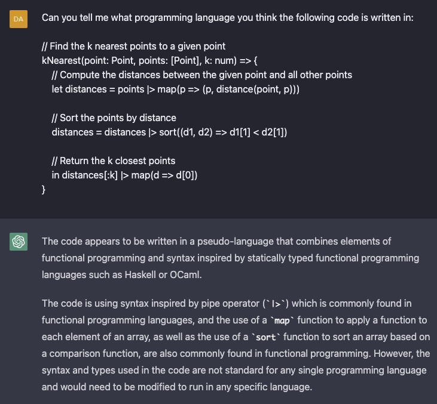

# Investigating the programming abilities of ChatGPT with an abitrary DSL

## Large language models, domain-specific languages, and ChatGPT

Large language models (LLMs) such as [ChatGPT](https://openai.com/blog/chatgpt/) and [Claude](https://scale.com/blog/chatgpt-vs-claude) have demonstrated impressive programming abilities, and are capable of [solving problems](https://github.com/mccaffary/ChatGPT-Project-Euler) across a wide range of languages and their [taxonomies](https://github.com/mccaffary/ChatGPT-Domain-Specific-Language/blob/main/images/programming_language_expressiveness.png). Despite these successes, some scepticism persists over the extent to which these models exhibit any underlying appreciation of the syntactic and operational rules underlying these languages (*versus* memorisation of patterns from training data).

In this prompt-engineering repository, the programming abilities of ChatGPT are explored using an arbitrary domain-specific language (DSL). DSLs represent an attractive substrate for studying the inference capabilities of LLMs because they are novel and less likely to have been extensively encountered and memorised during training[^1]. As such, they enable a more direct test of the extent to which LLMs can infer the rules of novel programming languages in a [*few-shot manner*](https://arxiv.org/abs/2005.14165).

Here, the domain-specific language SIL (Symmetry Integration Language) was selected for two reasons. Firstly, it is extremely unlikely that ChatGPT has been exposed to any SIL code during training, as it is an in-house DSL developed by a tech-heavy hedge fund called Symmetry Investments. Secondly, as a programming language, it has some interesting features for the model to reproduce (e.g. it is a functional language, but lacks `let` expressions as in Haskell or OCaml).

[^1]: There is [evidence](https://arxiv.org/abs/2202.07646) that LLM memorisation is promoted by the frequency of training example presentation and the number of relevant tokens used to prompt the model.

## Prompt-engineering

Below is a collection of prompts consisting of short examples of SIL code which highlight its functionality. After prompting ChatGPT with the task and providing SIL code samples (see figure below; [full prompt history](https://github.com/mccaffary/ChatGPT-Domain-Specific-Language/blob/main/prompt_library/full_prompt_history.txt) and [SIL code examples](https://github.com/mccaffary/ChatGPT-Domain-Specific-Language/tree/main/images/prompts_) are also in this repo), I asked it to implement a number of mainstream programing tasks in SIL.

<details>
<summary>Prompt 1 (example SIL code)</summary>
<br>

- Many ways of doing this; for first product itertion, can use simply similarity metric for company information
  
- Collaborative filtering is a good first-pass for this, and an influential recent [paper](https://arxiv.org/abs/1802.05814) shows that VAEs (which I use in my modelling) outperform classic approaches at collaborative filtering (see notebook)

- Ultimately, could leverage word embeddings/ word-to-vec models, such as those used in my [research](https://snap.stanford.edu/node2vec/)
  
</details>

<details>
<summary>Prompt 2 (example SIL code)</summary>
<br>

```ruby
require 'redcarpet'
markdown = Redcarpet.new("Hello World!")
puts markdown.to_html
```
  
</details>

<details>
<summary>Prompt 3 (example SIL code)</summary>
<br>

- Many ways of doing this; for first product itertion, can use simply similarity metric for company information
  
- Collaborative filtering is a good first-pass for this, and an influential recent [paper](https://arxiv.org/abs/1802.05814) shows that VAEs (which I use in my modelling) outperform classic approaches at collaborative filtering (see notebook)

- Ultimately, could leverage word embeddings/ word-to-vec models, such as those used in my [research](https://snap.stanford.edu/node2vec/)
  
</details>

<details>
<summary>Prompt task 1: Implement a simple relational database</summary>
<br>
  
As a first exercise, I asked the model to implement a very simple relational database in SIL, with basic functionalities such as comparing and printing the difference between two data structure (note that `//` denotes commenting in SIL).

```d
// Here, ChatGPT was prompted to write a a very simple, schematic relational database in SIL
// This prompt proved too general, perhaps, and after requesting further information, I prompted the model to generate a simple, schematic database with functionalities such as "compare" and "diff" for two or more tables

users = [    {"id": 1, "name": "John Doe", "email": "johndoe@example.com"},    {"id": 2, "name": "Jane Smith", "email": "janesmith@example.com"},    {"id": 3, "name": "Bob Johnson", "email": "bobjohnson@example.com"},]

orders = [    {"id": 1, "user_id": 1, "product": "Widget", "quantity": 2, "price": 19.99},    {"id": 2, "user_id": 2, "product": "Gadget", "quantity": 1, "price": 29.99},    {"id": 3, "user_id": 3, "product": "Thingamajig", "quantity": 3, "price": 39.99},]

// Compare two tables
compareTables(table1, table2) => {
    table1 == table2
}

//Diff two tables
diffTables(table1, table2) => {
    table1.filter(i => !table2.includes(i))
}

print(compareTables(users, users)) // true
print(diffTables(users, orders)) // [{"id": 1, "name": "John Doe", "email": "johndoe@example.com"}]
```
  
</details>

<details>
<summary>Prompt task 2: Implement bubblsort</summary>
<br>

Implementing sorting algorithms is an archetypal software engineering interview question. Here, I asked ChatGPT to implement [bubblesort](https://en.wikipedia.org/wiki/Bubble_sort) (conceptually the most basic sorting algorithm) in SIL. Below is the response:

```d
bubbleSort(arr) => {
    for i in 1...len(arr) {
        for j in 1...len(arr) - i {
            if (arr[j] > arr[j+1]) {
                temp = arr[j]
                arr[j] = arr[j+1]
                arr[j+1] = temp
            }
        }
    }
    arr
}

arr = [4, 6, 1, 3, 5, 2]
print(bubbleSort(arr))
```
Although this script is, indeed, a working implementation of bubblesort, the model broadly ignores the *functional* aspects of SIL. For instance, this implementation of bubblesort using `for` loops instead of recursion.
  
</details>

<details>
<summary>Prompt task 3: Implement a function to compute the median of an array/list</summary>
<br>

Next, I prompted the model to write a script for computing the median of a list (generated response below). This was, perhaps, one of the least satisfying responses. Firstly, despite `if/else` statements featuring in the example SIL code with which I prompted the model, the syntax in this generated code is incorrect. Secondly, ChatGPT hallucinates (or assumes) the presence of a module called `math` and a buil-in function `sort` (these are reasonable assumptions, but it does significantly decrease the complexity of the prompted problem).

```d
// Notably, despite if/else statements featuring in the code prompts used for training, ChatGPT gets the syntax wrong here

import math

// Function to compute the median of a list of integers
median(numbers) => {
    // Sort the list of numbers
    sortedNumbers = sort(numbers)

    // Get the middle index of the sorted list
    middleIndex = math.floor(len(sortedNumbers) / 2)

    // If the list has an odd number of elements, return the middle element
    if len(sortedNumbers) % 2 == 1:
        return sortedNumbers[middleIndex]
    // Otherwise, return the average of the two middle elements
    else:
        return (sortedNumbers[middleIndex - 1] + sortedNumbers[middleIndex]) / 2
}

```
  
</details>

<details>
<summary>Prompt task 4: Implement the k-nearest neighbours algorithm</summary>
<br>
  
ChatGPT was next prompted to implement the *k*-nearest neighbours algorithm in SIL. This is actually the result of two prompts (as described in the generated code block below), because the model hallucinates/assumes a module called `distances` in the first attempt. In the second attempt, I prompted it to implement the algorithm without assuming the existence of this module.

ChatGPT's performance here is mixed. Firstly, in some cases, it ignores the functional aspects of SIL (such as implementing a `for` loop in the first attempt. In other parts of the implementation, however, it does appreciate that SIL is functional, and employs `|>` and `map` operators accurately. Notably, the model does appear to hallucinate `let` bindings which do not feature in the example code with which it was prompted. This is likely due to conflating the functionality of SIL code with OCaml or F#.

```d
// Note that this is the fusion of two separate scripts generated by ChatGPT to solve the k-nearest neighbours algorithm, as described in the comments below
// Overall, these attempts seem reasonable, but it does appear to hallucinate "let" bindings which do not feature in the example code with which it was prompted. This is likely due to conflating the functionality of SIL code with OCaml or F#

// Attempt 1:
// This is the first ChatGPT attempt when prompted to generate a script for the k-nearest neighbours algorithm
// In this case, it assumes (or hallucinates) a library called "distances"

import distances

// Define a point as a tuple of x and y coordinates
type Point = (num, num)

// Find the distance between two points
distance(p1: Point, p2: Point) => {
    let xDistance = p1[0] - p2[0]
    let yDistance = p1[1] - p2[1]
    in sqrt(xDistance * xDistance + yDistance * yDistance)
}

// Find the k nearest points to a given point
kNearest(point: Point, points: [Point], k: num) => {
    // Compute the distances between the given point and all other points
    let distances = points |> map(p => (p, distance(point, p)))

    // Sort the points by distance
    distances = distances |> sort((d1, d2) => d1[1] < d2[1])

    // Return the k closest points
    in distances[:k] |> map(d => d[0])
}

// Attempt 2:
// Next, ChatGPT is prompted to generate a script without importing the questionable "distances" library
// Again, it assumes some in-built functions, such as "sort" or "sqrt"

// Function to calculate the distance between two points
distance(p1, p2) => {
    sum = 0
    for i in 0..len(p1) - 1 {
        sum = sum + (p1[i] - p2[i])^2
    }
    sqrt(sum)
}

// Function to find the k nearest neighbors
k_nearest_neighbors(data, point, k) => {
    distances = data |> map(p => (p, distance(p, point)))
    distances |> sort((a, b) => a[1] < b[1]) |> take(k) |> map(p => p[0])
}

```
  
</details>

<details>
<summary>Prompt task 5: Solving Project Euler problems in SIL</summary>
<br>

[Project Euler](https://projecteuler.net/) is a collection of mathematical and programming problems (which I think make [interesting prompts](https://github.com/mccaffary/ChatGPT-Project-Euler) for LLMs). Here, I prompt ChatGPT to solve the first two Project Euler problems using SIL. At this point, ChatGPT's repsonses dteriorated somewhat; neither of these solutions bears much resemblance to either the high-level functionality of SIL nor its exaxct syntax. It might be interesting to provide further SIL code examples at this point and then re-prompt the model to solve these problems.

```d
// Project Euler problem #1:
// Here, my prompt was to solve the (easy) first problem of the Project Euler series (https://projecteuler.net/problem=1)
// Notably, despite if/else statements featuring in the code prompts used for training, ChatGPT gets the syntax wrong here

result = 0
for i in 1...1000 {
    if (i % 3 == 0 || i % 5 == 0) {
        result += i
    }
}
print(result)
```

```d
// Project Euler problem #2:
// This prompt is to solve the second Project Euler problem (https://projecteuler.net/problem=2)
// The solution proposed by ChatGPT is sensible, but potentially inefficient, and ignores the recursion of functional languages
// Notably, despite if/else statements featuring in the code prompts used for training, ChatGPT gets the syntax wrong here

result = 0

fib(n) => {
    if (n <= 1) {
        return n
    }
    return fib(n-1) + fib(n-2)
}

for i in 1...100 {
    val = fib(i)
    if (val > 4000000) {
        break
    }
    if (val % 2 == 0) {
        result += val
    }
}

print(result)

```
  
</details>

## High-level summary

Exploring the ability of LLMs to infer and understand the features of a novel programming language in a *few-shot* manner remains an open and interesting question. Here, these capacities were explored in the context of prompting ChatGPT to solve prompted problems in a novel domain-specific language (DSL) called SIL. DSLs are a potentially useful test case for exploring *inference* vs *memorisation* in LLMs, as they often have distinctive features and are less likely to have been extensively encountered during training (if at all).
  
Overall, the performance was mixed: ChatGPT correctly understood that this DSL is a functional programming language (although it sometimes had to be re-prompted of this), and implemented its solutions accordingly. However, it broadly failed to capture the syntactic rules of this DSL from the five example scripts provided. Further investigations (such as using other DSLs, developing some more formal metric for evaluating the LLM-generated code, or quantifying the learning dynamics of the model) would make for an intriguing extension of this repo. Finally, in a separate ChatGPT session, I provided this meta-prompt to determine how the model interpreted its own SIL code:
  

> ChatGPT examines its own attempt to write code in the domain-specific language SIL, and describes some of its features.
  
